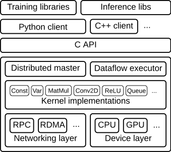

tensorflow reading code
===
[tensorflow README.md](README.md)

base on tensorflow 2.6.2 [source](https://github.com/tensorflow/tensorflow/releases/tag/v2.6.2)

# 架构
TensorFlow 模块化和分层设计十分精良，具体模块和层层如下：

整个框架以C API为界，分为前端和后端两大部分。
* 前端：提供编程模型，多语言的接口支持，比如Python Java C++等。通过C API建立前后端的连接，后面详细讲解。

* 后端：提供运行环境，完成计算图的执行。进一步分为4层   
  * 运行时：分为分布式运行时和本地运行时，负责计算图的接收，构造，编排等。
  * 计算层：提供各op算子的内核实现，例如conv2d, relu等
  * 通信层：实现组件间数据通信，基于GRPC和RDMA两种通信方式
  * 设备层：提供多种异构设备的支持，如CPU GPU TPU FPGA等

# 源码
[tensorflow](tensorflow/README.md)

[third_party](third_party/README.md)

# 编译优化

* [mlir](tensorflow/compiler/mlir/README.md)
* [xla](tensorflow/compiler/xla/README.md)

# 阅读

## framwork

* [tensor](docs/tensor.md) 张量
* [session](docs/session.md)
