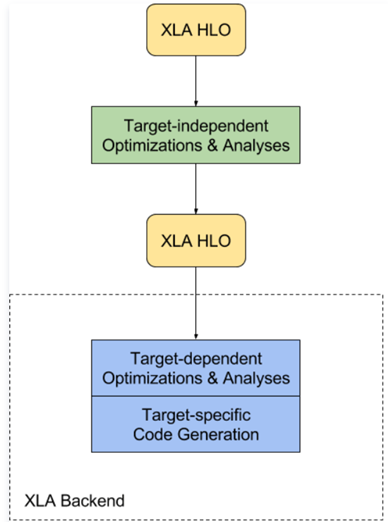
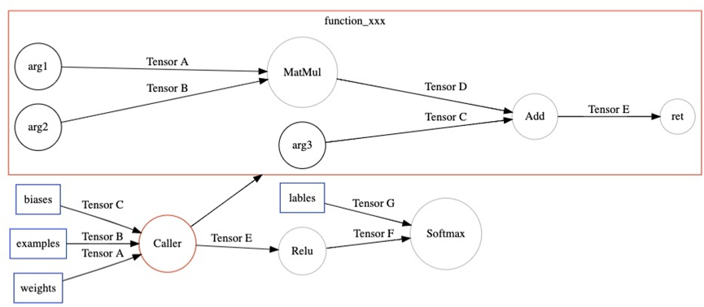
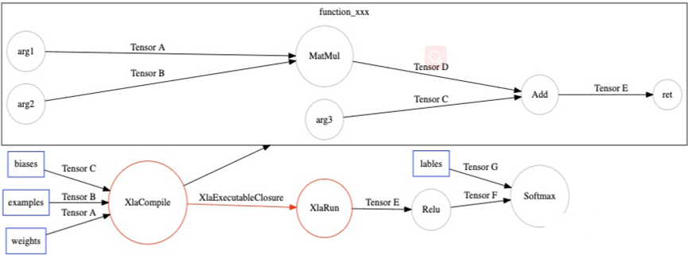
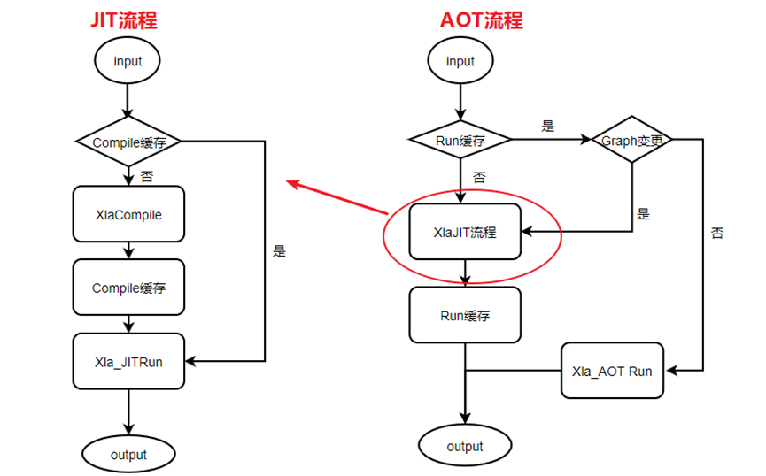

xla
===

[原文链接](https://bbs.huaweicloud.com/blogs/313833)

# 初识XLA

XLA的全称是Accelerated Linear Algebra，即加速线性代数。作为一种深度学习编译器，长期以来被作为Tensorflow框架的一个试验特性被开发，历时至今已经超过两三年了，随着Tensorflow 2.X的发布，XLA也终于从试验特性变成了默认打开的特性。

XLA的输入语言称为“ HLO IR”，或简称为HLO（高级优化器，High Level Optimizer）。 HLO的语义在“ 操作语义”页面上描述。将HLO视为编译器IR最为方便。


XLA也是基于LLVM框架开发的，前端的输入是Graph，前端没有将Graph直接转化为LLVM IR，而是转化为了XLA的自定义的中间表示HLO IR.并且为HLO IR设计了一系列的优化器。经过优化的HLO IR接下来会被转化为LLVM IR。

# LLVM

提到编译器就不得不提大名鼎鼎的LLVM。LLVM是一个编译器框架，由C++语言编写而成，包括一系列分模块、可重用的编译工具。

LLVM框架的主要组成部分有：

* 前端：负责将源代码转换为一种中间表示

* 优化器：负责优化中间代码

* 后端：生成可执行机器码的模块


LLVM为不同的语言提供了同一种中间表示LLVM IR，这样子如果我们需要开发一种新的语言的时候，我们只需要实现对应的前端模块，如果我们想要支持一种新的硬件，我们只需要实现对应的后端模块，其他部分可以复用。

# XLA编译

XLA也是基于LLVM框架开发的，前端的输入是Graph，前端没有将Graph直接转化为LLVM IR。首先XLA的功能主要体现在两个方面：

* 即时编译（Just-in-time）
* 超前编译（Aheda-of-time）

无论是哪个功能，都是服务于以下目的：

* 提高代码执行速度
* 优化存储使用

此外，XLA还有着大部分深度学习编译器都有的梦想：摆脱计算库的限制，自动生成算子代码并支持在多硬件上的良好可移植性。



作为编译器，XLA负责对前端定义的计算图进行优化。如上图所示，XLA的优化流程可以分成两方面，目标无关优化和目标相关优化。在优化步骤之间传递的是计算图的中间表示形式，HLO，即High Level Optimizer(高级优化器) ，XLA用这种中间表示形式表示正在被优化的计算图，其有自己的文法和语义，这里不做详细介绍

# XLA优势

* 编译子计算图以减少短暂运算的执行时间，从而消除运行时的开销；融合流水线运算以降低内存开销；并针对已知张量形状执行专门优化以支持更积极的常量传播。
* 提高内存使用率： 分析和安排内存使用，消除了许多中间存储缓冲区。
* 降低对自定义运算的依赖：通过提高自动融合的低级运算的性能，使之达到手动融合的自定义运算的性能水平，从而消除对多种自定义运算的需求。
* 提高便携性：使针对新颖硬件编写新后端的工作变得相对容易，在新硬件上运行时，大部分程序都能够以未经修改的方式运行。与针对新硬件专门设计各个整体运算的方式相比，这种模式不必重新编写 程序即可有效利用这些运算。

# XLA工作原理

我们先来看XLA如何作用于计算图，下面是一张简单的计算图


这里我们假设XLA仅支持matmul和add。XLA通过图优化方法，在计算图中找到适合被JIT编译的区域


XLA把这个区域定义为一个Cluster，作为一个独立的JIT编译单元，计算图中通过Node Attribute标示


然后另一个的图优化方法，把cluster转化成TensorFlow的一个Function子图。在原图上用一个Caller节点表示这个Function在原图的位置



最后调用TensorFlow的图优化方法(BuildXlaOps)，把Function节点转化成特殊的Xla节点。



在TensorFlow运行时，运行到XlaCompile时，编译Xla cluster子图，然后把编译完的Executable可执行文件通过XlaExecutableClosure传给XlaRun运行。

接着根据虚拟指令分配GPU Stream和显存，然后IrEmitter把HLO Graph转化成由编译器的中间表达LLVM IR表示的GPU Kernel。最后由LLVM生成nvPTX（Nvidia定义的虚拟底层指令表达形式）表达，进而由NVCC生成CuBin可执行代码。

# AOT和JIT

JIT，动态(即时)编译，边运行边编译；AOT，指运行前编译。这两种编译方式的主要区别在于是否在“运行时”进行编译，对于AI训练模型中，AOT模式下更具有性能优势，具体流程如下图：



对于大部分AI模型来说，训练过程一般情况下图是不会怎么变的，所以在训这样子就在执行过程中省略练的时候使用AOT模式能大大提高训练的速度

# tensorflow xla

运行 TensorFlow 程序后，所有操作均由 TensorFlow 执行程序单独执行。每个 TensorFlow 操作都有一个预编译的 GPU 内核实现，可以将执行程序分派给该实现。

XLA 提供了一种运行模型的替代模式：它会将 TensorFlow 图编译成一系列专门为给定模型生成的计算内核。由于这些内核是模型特有的，因此它们可以利用模型专属信息进行优化。以 XLA 在简单的 TensorFlow 计算环境中进行的优化为例：

```python
def model_fn(x, y, z):
  return tf.reduce_sum(x + y * z)
```
如果在不使用 `XLA` 的情况下运行，图会启动三个内核：分别对应于乘法、加法和减法运算。但是，`XLA` 可以优化该图，使其启动一次内核就能计算结果。它通过将加法、乘法和减法“融合”到一个 GPU 内核中来实现这一点。此外，这种融合操作不会将由 `y*z` 和 `x+y*z` 生成的中间值写出到内存中；而是直接将这些中间计算的结果“流式传输”给用户，同时将它们完全保留在 GPU 寄存器中。融合是 XLA 采用的最重要的一项优化措施。 内存带宽通常是硬件加速器上最稀缺的资源，因此消除内存操作是提高性能的最佳方法之一。

