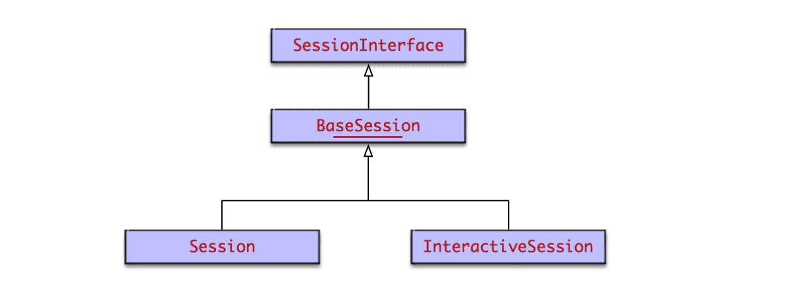
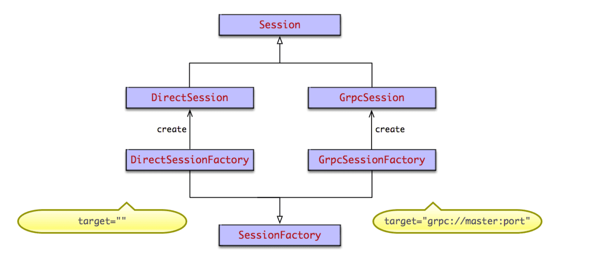

session
===

# session是什么
Session是TensorFlow前后端连接的桥梁。用户利用session使得client能够与master的执行引擎建立连接，并通过session.run()来触发一次计算。它建立了一套上下文环境，封装了operation计算以及tensor求值的环境。

session创建时，系统会分配一些资源，比如graph引用、要连接的计算引擎的名称等。故计算完毕后，需要使用session.close()关闭session，避免引起内存泄漏，特别是graph无法释放的问题。可以显式调用session.close(),或利用with上下文管理器，或者直接使用InteractiveSession。

session之间采用共享graph的方式来提高运行效率。一个session只能运行一个graph实例，但一个graph可以运行在多个session中。一般情况下，创建session时如果不指定Graph实例，则会使用系统默认Graph。常见情况下，我们都是使用一个graph，即默认graph。当session创建时，不会重新创建graph实例，而是默认graph引用计数加1。当session close时，引用计数减1。只有引用计数为0时，graph才会被回收。这种graph共享的方式，大大减少了graph创建和回收的资源消耗，优化了TensorFlow运行效率。

# 默认session

op运算和tensor求值时，如果没有指定运行在哪个session中，则会运行在默认session中。通过session.as_default()可以将自己设置为默认session。但个人建议最好还是通过session.run(operator)和session.run(tensor)来进行op运算和tensor求值。

operation.run()等价于tf.get_default_session().run(operation)

```python
@tf_export("Operation")
class Operation(object):
    # 通过operation.run()调用，进行operation计算
    def run(self, feed_dict=None, session=None):
        _run_using_default_session(self, feed_dict, self.graph, session)
        
    def _run_using_default_session(operation, feed_dict, graph, session=None):
          # 没有指定session，则获取默认session
          if session is None:
    		session = get_default_session()
            
		 # 最终还是通过session.run()进行运行的。tf中任何运算，都是通过session来run的。
          # 通过session来建立client和master的连接，并将graph发送给master，master再进行执行
  		 session.run(operation, feed_dict)

```
tensor.eval()等价于tf.get_default_session().run(tensor), 如下

```python
@tf_export("Tensor")
class Tensor(_TensorLike):
    # 通过tensor.eval()调用，进行tensor运算
	def eval(self, feed_dict=None, session=None):
		return _eval_using_default_session(self, feed_dict, self.graph, session)
		
	def _eval_using_default_session(tensors, feed_dict, graph, session=None):
           # 如果没有指定session，则获取默认session
		  if session is None:
    		session = get_default_session()
  		  return session.run(tensors, feed_dict)

```

# 默认session的管理
tf通过运行时维护的session本地线程栈，来管理默认session。故不同的线程会有不同的默认session，默认session是线程作用域的。

```python
# session栈
_default_session_stack = _DefaultStack()

# 获取默认session的接口
@tf_export("get_default_session")
def get_default_session():
  return _default_session_stack.get_default()

# _DefaultStack默认session栈是线程相关的
class _DefaultStack(threading.local):
      # 默认session栈的创建，其实就是一个list
      def __init__(self):
    	super(_DefaultStack, self).__init__()
    	self._enforce_nesting = True
    	self.stack = []  
        
      # 获取默认session
      def get_default(self):
    	return self.stack[-1] if len(self.stack) >= 1 else None

```

# 前端Session类型

会话Session的UML类图如下


分为两种类型，普通Session和交互式InteractiveSession。InteractiveSession和Session基本相同，区别在于

InteractiveSession创建后，会将自己替换为默认session。使得之后operation.run()和tensor.eval()的执行通过这个默认session来进行。特别适合Python交互式环境。
InteractiveSession自带with上下文管理器。它在创建时和关闭时会调用上下文管理器的enter和exit方法，从而进行资源的申请和释放，避免内存泄漏问题。这同样很适合Python交互式环境。

Session和InteractiveSession的代码逻辑不多，主要逻辑均在其父类BaseSession中。主要代码如下
```python
@tf_export('Session')
class Session(BaseSession):
    def __init__(self, target='', graph=None, config=None):
        # session创建的主要逻辑都在其父类BaseSession中
        super(Session, self).__init__(target, graph, config=config)
    	self._default_graph_context_manager = None
    	self._default_session_context_manager = None

```

```python
@tf_export('InteractiveSession')
class InteractiveSession(BaseSession):
    def __init__(self, target='', graph=None, config=None):
        self._explicitly_closed = False
        
        # 将自己设置为default session
    	self._default_session = self.as_default()
    	self._default_session.enforce_nesting = False
        
        # 自动调用上下文管理器的__enter__()方法
    	self._default_session.__enter__()
    	self._explicit_graph = graph
       
    def close(self):
    	super(InteractiveSession, self).close()
    	## 省略无关代码
        ## 自动调用上下文管理器的__exit__()方法，避免内存泄漏
        self._default_session.__exit__(None, None, None)
        self._default_session = None

```
BaseSession基本包含了所有的会话实现逻辑。包括会话的整个生命周期，也就是创建 执行 关闭和销毁四个阶段。生命周期后面详细分析。BaseSession包含的主要成员变量有graph引用，序列化的graph_def, 要连接的tf引擎target，session配置信息config等。

# 后端Session类型
在后端master中，根据前端client调用tf.Session(target=’’, graph=None, config=None)时指定的target，来创建不同的Session。target为要连接的tf后端执行引擎，默认为空字符串。Session创建采用了抽象工厂模式，如果为空字符串，则创建本地DirectSession，如果以grpc://开头，则创建分布式GrpcSession。类图如下



DirectSession只能利用本地设备，将任务创建到本地的CPU GPU上。而GrpcSession则可以利用远端分布式设备，将任务创建到其他机器的CPU GPU上，然后通过grpc协议进行通信。grpc协议是谷歌发明并开源的远程通信协议。

# Session生命周期

Session作为前后端连接的桥梁，以及上下文运行环境，其生命周期尤其关键。大致分为4个阶段

* 创建：通过tf.Session()创建session实例，进行系统资源分配，特别是graph引用计数加1
* 运行：通过session.run()触发计算的执行，client会将整图graph传递给master，由master进行执行
* 关闭：通过session.close()来关闭，会进行系统资源的回收，特别是graph引用计数减1.
* 销毁：Python垃圾回收器进行GC时，调用session.__del__()进行回收。

生命周期方法入口基本都在前端Python的BaseSession中，它会通过swig自动生成的函数符号映射关系，调用C层的实现。

## 创建

先从BaseSession类的init方法看起，只保留了主要代码。

```python
def __init__(self, target='', graph=None, config=None):
    # graph表示构建的图。TensorFlow的一个session会对应一个图。这个图包含了所有涉及到的算子
    # graph如果没有设置（通常都不会设置），则使用默认graph
    if graph is None:
      self._graph = ops.get_default_graph()
    else:
      self._graph = graph

    self._opened = False
    self._closed = False

    self._current_version = 0
    self._extend_lock = threading.Lock()

    # target为要连接的tf执行引擎
    if target is not None:
      self._target = compat.as_bytes(target)
    else:
      self._target = None

    self._delete_lock = threading.Lock()
    self._dead_handles = []

    # config为session的配置信息
    if config is not None:
      self._config = config
      self._add_shapes = config.graph_options.infer_shapes
    else:
      self._config = None
      self._add_shapes = False

    self._created_with_new_api = ops._USE_C_API

    # 调用C层来创建session
    self._session = None
    opts = tf_session.TF_NewSessionOptions(target=self._target, config=config)
    self._session = tf_session.TF_NewSession(self._graph._c_graph, opts, status)
        
```

BaseSession先进行成员变量的赋值，然后调用TF_NewSession来创建session。TF_NewSession()方法由swig自动生成，在bazel-bin/tensorflow/python/pywrap_tensorflow_internal.py中

```python
def TF_NewSession(graph, opts, status):
    return _pywrap_tensorflow_internal.TF_NewSession(graph, opts, status)

```

_pywrap_tensorflow_internal包含了C层函数的符号表。在swig模块import时，会加载pywrap_tensorflow_internal.so动态链接库，从而得到符号表。在pywrap_tensorflow_internal.cc中，注册了供Python调用的函数的符号表，从而实现Python到C的函数映射和调用。

```c++
// c++函数调用的符号表，Python通过它可以调用到C层代码。符号表和动态链接库由swig自动生成
static PyMethodDef SwigMethods[] = {
      // .. 省略其他函数定义
	 // TF_NewSession的符号表，通过这个映射，Python中就可以调用到C层代码了。
	 { (char *)"TF_NewSession", _wrap_TF_NewSession, METH_VARARGS, NULL},
     // ... 省略其他函数定义
}

```

最终调用到c_api.c中的TF_NewSession()

```c
// TF_NewSession创建session的新实现，在C层后端代码中
TF_Session* TF_NewSession(TF_Graph* graph, const TF_SessionOptions* opt,
                          TF_Status* status) {
  Session* session;
  // 创建session
  status->status = NewSession(opt->options, &session);
  if (status->status.ok()) {
    TF_Session* new_session = new TF_Session(session, graph);
    if (graph != nullptr) {
      // 采用了引用计数方式，多个session共享一个图实例，效率更高。
      // session创建时，引用计数加1。session close时引用计数减1。引用计数为0时，graph才会被回收。
      mutex_lock l(graph->mu);
      graph->sessions[new_session] = Status::OK();
    }
    return new_session;
  } else {
    DCHECK_EQ(nullptr, session);
    return nullptr;
  }
}
```
session创建时，并创建graph，而是采用共享方式，只是引用计数加1了。这种方式减少了session创建和关闭时的资源消耗，提高了运行效率。NewSession()根据前端传递的target，使用sessionFactory创建对应的TensorFlow::Session实例

```c++
Status NewSession(const SessionOptions& options, Session** out_session) {
  SessionFactory* factory;
  const Status s = SessionFactory::GetFactory(options, &factory);

  // 通过sessionFactory创建多态的Session。本地session为DirectSession，分布式为GRPCSession
  *out_session = factory->NewSession(options);
  if (!*out_session) {
    return errors::Internal("Failed to create session.");
  }
  return Status::OK();
}
```
创建session采用了抽象工厂模式。根据client传递的target，来创建不同的session。如果target为空字符串，则创建本地DirectSession。如果以grpc://开头，则创建分布式GrpcSession。TensorFlow包含本地运行时和分布式运行时两种运行模式。

下面来看DirectSessionFactory的NewSession()方法

```c++
class DirectSessionFactory : public SessionFactory {
 public:
  Session* NewSession(const SessionOptions& options) override {
    std::vector<Device*> devices;
      
    // job在本地执行
    const Status s = DeviceFactory::AddDevices(
        options, "/job:localhost/replica:0/task:0", &devices);
    if (!s.ok()) {
      LOG(ERROR) << s;
      return nullptr;
    }

    DirectSession* session =
        new DirectSession(options, new DeviceMgr(devices), this);
    {
      mutex_lock l(sessions_lock_);
      sessions_.push_back(session);
    }
    return session;
  }

```
GrpcSessionFactory的NewSession()方法就不详细分析了，它会将job任务创建在分布式设备上，各job通过grpc协议通信。

## 运行

通过session.run()可以启动graph的执行。入口在BaseSession的run()方法中, 同样只列出关键代码

```python
class BaseSession(SessionInterface):
    def run(self, fetches, feed_dict=None, options=None, run_metadata=None):
        # fetches可以为单个变量，或者数组，或者元组。它是图的一部分，可以是操作operation，也可以是数据tensor，或者他们的名字String
        # feed_dict为对应placeholder的实际训练数据，它的类型为字典
        result = self._run(None, fetches, feed_dict, options_ptr,run_metadata_ptr)
        return result
    
    def _run(self, handle, fetches, feed_dict, options, run_metadata):
    	# 创建fetch处理器fetch_handler
        fetch_handler = _FetchHandler(
            self._graph, fetches, feed_dict_tensor, feed_handles=feed_handles)

        # 经过不同类型的fetch_handler处理，得到最终的fetches和targets
        # targets为要执行的operation，fetches为要执行的tensor
        _ = self._update_with_movers(feed_dict_tensor, feed_map)
        final_fetches = fetch_handler.fetches()
        final_targets = fetch_handler.targets()

        # 开始运行
        if final_fetches or final_targets or (handle and feed_dict_tensor):
          results = self._do_run(handle, final_targets, final_fetches,
                                 feed_dict_tensor, options, run_metadata)
        else:
          results = []

        # 输出结果到results中
        return fetch_handler.build_results(self, results)

    def _do_run(self, handle, target_list, fetch_list, feed_dict, options, run_metadata):
        # 将要运行的operation添加到graph中
        self._extend_graph()
        
        # 执行一次运行run，会调用底层C来实现
        return tf_session.TF_SessionPRunSetup_wrapper(
              session, feed_list, fetch_list, target_list, status)
      
    # 将要运行的operation添加到graph中
    def _extend_graph(self):
        with self._extend_lock:
          if self._graph.version > self._current_version:
            # 生成graph_def对象，它是graph的序列化表示
            graph_def, self._current_version = self._graph._as_graph_def(
                from_version=self._current_version, add_shapes=self._add_shapes)

            # 通过TF_ExtendGraph将序列化后的graph，也就是graph_def传递给后端
            with errors.raise_exception_on_not_ok_status() as status:
              tf_session.TF_ExtendGraph(self._session,
                                        graph_def.SerializeToString(), status)
            self._opened = True

```

逻辑还是十分复杂的，主要有一下几步

入参处理，创建fetch处理器fetch_handler，得到最终要执行的operation和tensor
对graph进行序列化，生成graph_def对象
将序列化后的grap_def对象传递给后端master。
通过后端master来run。
分别来看extend和run。

### extend添加节点到graph中
TF_ExtendGraph()会调用到c_api中，这个逻辑同样通过swig工具自动生成。下面看c_api.cc中的TF_ExtendGraph()方法
```c++
// 增加节点到graph中，proto为序列化后的graph
void TF_ExtendGraph(TF_DeprecatedSession* s, const void* proto,
                    size_t proto_len, TF_Status* status) {
  GraphDef g;
  // 先将proto反序列化，得到client传递的graph，放入g中
  if (!tensorflow::ParseProtoUnlimited(&g, proto, proto_len)) {
    status->status = InvalidArgument("Invalid GraphDef");
    return;
  }

  // 再调用session的extend方法。根据创建的不同session类型，多态调用不同方法。
  status->status = s->session->Extend(g);
}

```
后端系统根据生成的Session类型，多态的调用Extend方法。如果是本地session，则调用DirectSession的Extend()方法。如果是分布式session，则调用GrpcSession的相关方法。下面来看GrpcSession的Extend方法。

```c++

Status GrpcSession::Extend(const GraphDef& graph) {
  CallOptions call_options;
  call_options.SetTimeout(options_.config.operation_timeout_in_ms());
  return ExtendImpl(&call_options, graph);
}

Status GrpcSession::ExtendImpl(CallOptions* call_options,
                               const GraphDef& graph) {
  bool handle_is_empty;
  {
    mutex_lock l(mu_);
    handle_is_empty = handle_.empty();
  }
  if (handle_is_empty) {
    // 如果graph句柄为空，则表明graph还没有创建好，此时extend就等同于create
    return Create(graph);
  }
  mutex_lock l(mu_);
  ExtendSessionRequest req;
  req.set_session_handle(handle_);
  *req.mutable_graph_def() = graph;
  req.set_current_graph_version(current_graph_version_);
  ExtendSessionResponse resp;
    
  // 调用底层实现，来添加节点到graph中
  Status s = master_->ExtendSession(call_options, &req, &resp);
  if (s.ok()) {
    current_graph_version_ = resp.new_graph_version();
  }
  return s;
}

```

Extend()方法中要注意的一点是，如果是首次执行Extend(), 则要先调用Create()方法进行graph的注册。否则才是执行添加节点到graph中。

### 执行图的计算
同样，Python通过swig自动生成的代码，来实现对C API的调用。C层实现在c_api.cc的TF_Run()中。

```c
// session.run()的C层实现
void TF_Run(TF_DeprecatedSession* s, const TF_Buffer* run_options,
            // Input tensors，输入的数据tensor
            const char** c_input_names, TF_Tensor** c_inputs, int ninputs,
            // Output tensors，运行计算后输出的数据tensor
            const char** c_output_names, TF_Tensor** c_outputs, int noutputs,
            // Target nodes，要运行的节点
            const char** c_target_oper_names, int ntargets,
            TF_Buffer* run_metadata, TF_Status* status) {
  // 省略一段代码
  TF_Run_Helper(s->session, nullptr, run_options, input_pairs, output_names,
                c_outputs, target_oper_names, run_metadata, status);
}

// 真正的实现了session.run()
static void TF_Run_Helper() {
    RunMetadata run_metadata_proto;
    // 调用不同的session实现类的run方法，来执行
    result = session->Run(run_options_proto, input_pairs, output_tensor_names,
                          target_oper_names, &outputs, &run_metadata_proto);
    // 省略代码
}
```
最终会调用创建的session来执行run方法。DirectSession和GrpcSession的Run()方法会有所不同。后面很复杂，就不接着分析了。

## 关闭

通过session.close()来关闭session，释放相关资源，防止内存泄漏。

```python
class BaseSession(SessionInterface):
	def close(self):
        tf_session.TF_CloseSession(self._session, status)
```
会调用到C API的TF_CloseSession()方法。
```c
void TF_CloseSession(TF_Session* s, TF_Status* status) {
  status->status = s->session->Close();
}
```

最终根据创建的session，多态的调用其Close()方法。同样分为DirectSession和GrpcSession两种。

```c++
::tensorflow::Status DirectSession::Close() {
    cancellation_manager_->StartCancel();
  {
    mutex_lock l(closed_lock_);
    if (closed_) return ::tensorflow::Status::OK();
    closed_ = true;
  }
    
  // 注销session
  if (factory_ != nullptr) factory_->Deregister(this);
  return ::tensorflow::Status::OK();
}
```
DirectSessionFactory中的Deregister()方法如下

```c++
void Deregister(const DirectSession* session) {
    mutex_lock l(sessions_lock_);
    // 释放相关资源
    sessions_.erase(std::remove(sessions_.begin(), sessions_.end(), session),
                    sessions_.end());
  }
```

## 销毁session

session的销毁是由Python的GC自动执行的。python通过引用计数方法来判断是否回收对象。当对象的引用计数为0，且虚拟机触发了GC时，会调用对象的__del__()方法来销毁对象。引用计数法有个很致命的问题，就是无法解决循环引用问题，故会存在内存泄漏。Java虚拟机采用了调用链分析的方式来决定哪些对象会被回收。

```python
class BaseSession(SessionInterface):  
  def __del__(self):
    # 先close，防止用户没有调用close()
    try:
      self.close()
	
    # 再调用c api的TF_DeleteSession来销毁session
    if self._session is not None:
      try:
        status = c_api_util.ScopedTFStatus()
        if self._created_with_new_api:
          tf_session.TF_DeleteSession(self._session, status)

```
c_api.cc中的相关逻辑如下
```c
void TF_DeleteSession(TF_Session* s, TF_Status* status) {
  status->status = Status::OK();
  TF_Graph* const graph = s->graph;
  if (graph != nullptr) {
    graph->mu.lock();
    graph->sessions.erase(s);
      
    // 如果graph的引用计数为0，也就是graph没有被任何session持有，则考虑销毁graph对象
    const bool del = graph->delete_requested && graph->sessions.empty();
    graph->mu.unlock();
    
    // 销毁graph对象
    if (del) delete graph;
  }
    
  // 销毁session和TF_Session 
  delete s->session;
  delete s;
}

```
TF_DeleteSession()会判断graph的引用计数是否为0，如果为0，则会销毁graph。然后销毁session和TF_Session对象。通过Session实现类的析构函数，来销毁session，释放线程池Executor，资源管理器ResourceManager等资源。

```c++
DirectSession::~DirectSession() {
  for (auto& it : partial_runs_) {
    it.second.reset(nullptr);
  }
  // 释放线程池Executor
  for (auto& it : executors_) {
    it.second.reset();
  }

  
  for (auto d : device_mgr_->ListDevices()) {
    d->op_segment()->RemoveHold(session_handle_);
  }

  // 释放ResourceManager
  for (auto d : device_mgr_->ListDevices()) {
    d->ClearResourceMgr();
  }
 
  // 释放CancellationManager实例
  functions_.clear();
  delete cancellation_manager_;

  // 释放ThreadPool 
  for (const auto& p_and_owned : thread_pools_) {
    if (p_and_owned.second) delete p_and_owned.first;
  }

  execution_state_.reset(nullptr);
  flib_def_.reset(nullptr);
}
```

# 总结
Session是TensorFlow的client和master连接的桥梁，client任何运算也是通过session来run。它是client端最重要的对象。在Python层和C++层，均有不同的session实现。session生命周期会经历四个阶段，create run close和del。四个阶段均由Python前端开始，最终调用到C层后端实现。由此也可以看到，TensorFlow框架的前后端分离和模块化设计是多么的精巧。

