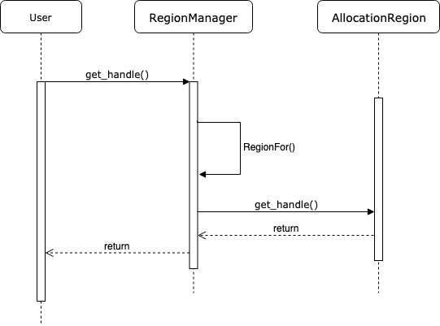

# BFC allocator

* [bfc_allocator.h](bfc_allocator.h)
* [bfc_allocator.cc](bfc_allocator.cc)

# Tensor 创建

[tensor.h](../framework/tensor.h#139)
[tensor.cc](../framework/tensor.cc#779)

在Tensor在创建的时候，立刻分配内存，在Tensorflow运行一轮之后，Tensor都已经被释放。下一轮计算会重新创建Tensor，并分配存储存储空间。

Tensor在创建时，传入`Allocator`对象，这个Allocator可以是任何实现，在GPU上是BFCAllocator。
```c++
Tensor::Tensor(Allocator* a, DataType type, const TensorShape& shape,
               const AllocationAttributes& allocation_attr)
    : shape_(shape), buf_(nullptr) {
  set_dtype(type);
  CHECK_NOTNULL(a);
  if (shape_.num_elements() > 0 || a->AllocatesOpaqueHandle()) {
    CASES(type, buf_ = new Buffer<T>(a, shape.num_elements(), allocation_attr));
  }
  if (MemoryLoggingEnabled() && !allocation_attr.allocation_will_be_logged &&
      buf_ != nullptr && buf_->data() != nullptr) {
    LogMemory::RecordTensorAllocation("Unknown (with attributes)",
                                      LogMemory::UNKNOWN_STEP_ID, *this);
  }
}
```
下面这行就是Tensor实际分配内存的代码。创建一个buff对象。
```c++
 CASES(type, buf_ = new Buffer<T>(a, shape.num_elements(), allocation_attr));
 ```

 ```c++
 template <typename T>
Buffer<T>::Buffer(Allocator* a, int64 n,
                  const AllocationAttributes& allocation_attr)
    : BufferBase(a, TypedAllocator::Allocate<T>(a, n, allocation_attr)),
      elem_(n) {}
```
这里实际调用allocator函数，buffer获得实际存储内存。这已经能够说明存储区分配的时机是在一个Tensor对象被创建时立即发生的。

# 内存分配与回收的性能
Tensor在每次创建时会得到存储区域，而每一轮训练都要重新创建新的Tensor，那么这里面临的一个问题：如此频繁的分配和回收存储区，如何才能做的高效？试想对于GPU来说，如果Allocate函数直接封装CUDA中昂贵的cudaMalloc函数，当Tensor被释放时直接调用cudaFree函数，那么训练速度将会因为这些overhead大打折扣。

# 国际化思路--内存池

如果你对操作系统这门课比较熟悉，那么应该很容易想到解决办法：将显存按照不同的大小一次性开辟出来，并组成存储池，每次调用Allocate函数时从存储池中获取，Tensor回收时将显存重新挂到存储池中。这样做确实可以满足性能需求，但是需要为此设计一个相对复杂的存储管理器。BFC Allocator就是TensorFlow中管理GPU显存的存储管理器。

# Best-Fit with Coalescing与dlmalloc

BFC的全称是Best-Fit with Coalescing。从TensorFlow源码注释中得知，BFC算法并非TensorFlow完全原创，而是dlmalloc的一个简单实现版本。dlmalloc是一款优秀的存储分配器，它以Doug Lea的名字命名，这个[网站](http://g.oswego.edu/dl/html/malloc.html)包含了dlmalloc的详细说明，有兴趣的同学可以去看一看。之所以在TensorFlow中引入一个简单版本的dlmalloc算法，是因为该算法可以非常高效的按需分配和回收存储区，并尽可能减少存储碎片。

# BFC Allocator基本原理

核心在于将存储区划分成块，并挂入存储池中进行管理。将存储区划分成存储块时要满足以下要求。

* 块内地址是连续地址
* 存储池中的块要以每个块基地址升序排列，并组织成双向链表
* 高地址块的size大于低地址块的size
  
TensorFlow将存储块以及相应的块信息抽象为一种叫做Chunk的数据结构

# 核心数据结构

## Chunk
Chunk是BFC最核心的数据结构之一，在TensorFlow源码中是以struct来描述的。具体来说，一个Chunk代表一段连续的存储空间，BFC要求各个Chunk要按照基地址升序排列并组织成双向链表，下图展示了Chunk的结构以及Chunk之间的连接关系。初始时，每个Chunk都有自己的size，并且这些size都是以256字节为模。应当注意，每个Chunk或者完全被标记为使用，或者完全标记为空闲，不存在该Chunk内只有部分空间被使用的情况。


prev，next：这两个变量起到指针作用，分别指向前驱和后继Chunk。因为在BFC Allocator模块中多个chunk都被放入了vector中，所以这两个指针实际上就是前驱和后继的index

ptr：该Chunk的起始存储地址，或者叫基地址

size：该Chunk描述存储区的实际总大小，每个Chunk的size是不同的，但都以256字节为模

requested_size：该Chunk描述存储区的使用大小，代表了用户请求使用的大小，它一定小于等于size。因为Chunk不能被部分使用，所以即使用户实际只使用requested_size，那么也只能将整个大小为size的Chunk全部分配出去，显然这可能会造成一些碎片的浪费

allocation_id：该值如果不为0，则代表已经被标记为使用，反之则是空闲

bin_num：代表该Chunk所在Bin的Index。Bin是另一个核心数据结构，下面将会做详细介绍

## Bin

如果我们想查询某一块符合条件的空闲Chunk并取出，那么只能对双向链表做遍历，显然这个效率不是很高。为了加速查询某块Chunk的速度，可以在创建Chunk链表时按一定顺序排列，并将整个有序链表在逻辑上切分成多个段，为每个段记录所包含的Chunk的范围，这种结构就是Bin，它相当于一种索引。因此，Bin结构是为了方便Chunk的查询而出现的。在BFC Allocator中，每个段中Chunk的顺序是按照size和基地址升序排序的，每个Bin都设有自己的bin_size，该bin_size表示该段包含的最小Chunk的size。这样一来，用户端就可以根据所需要申请的Memory大小直接找到对应的Bin，然后在该Bin中遍历寻找适合的Chunk。为了能够根据bin_size直接定位到Bin，规定bin_size与bin_num的大小关系为：bin_size=256 * 2bin_num。用户在申请Memory时，会将实际大小映射到最适合的bin_size上，然后再根据bin_size与bin_num的关系找到对应的Bin，进而在该段中遍历搜索。


Bin中Chunk的是通过Set组织的，为了能在Set中体现双向链表的逻辑，只需要让Chunk在Set中按照规则升序排列，并修正前驱后继指针即可。指定Chunk顺序的Comparator代码段定义在Bin结构中，如下所示。

```c++
// Sort first by size and then use pointer address as a tie breaker.
bool operator()(const ChunkHandle ha,
                const ChunkHandle hb) const NO_THREAD_SAFETY_ANALYSIS {
  const Chunk* a = allocator_->ChunkFromHandle(ha);
  const Chunk* b = allocator_->ChunkFromHandle(hb);
  if (a->size != b->size) {
    return a->size < b->size;
  }
  return a->ptr < b->ptr;
}
```

# 辅助工具类

## AllocationRegion与RegionManager
这两个类是起到辅助作用。BFC Allocator每次分配存储区时都以Chunk为单位，指向Chunk的指针又是ChunkHandle类型（实际为数组下标），但分配存储的最终目的是把Chunk中指向存储区域的头指针ptr分配给请求方。另外，当系统回收存储区时，面对的也是存储区的头指针，那么如果不能根据头指针找到Chunk和Bin信息，回收就不能成功。因此这里显然应该设计一系列接口和函数：它能够记录每次分配的Chunk，并且能够保存分配存储区的地址ptr与Chunk之间的映射关系。AllocationRegion和RegionManager就是完成这些功能的接口。

具体而言，AllocationRegion对应一次存储区分配的记录。一次存储区分配的信息包括起始地址ptr和存储区大小memory_size，这可能包括多个Chunk，所以该结构要记录此次分配中所包含所有Chunk的信息。RegionManager是AllocationRegion的管理器，它维护了AllocationRegion的数组。在RegionManager中，AllocationRegion数组是需要按照end_ptr地址排序的。

利用RegionManager查询某个ptr所对应的ChunkHandle的时序图如下图所示。



# BFC分配与回收策略

介绍完基本结构和BFC的设计思想之后，就可以试着去理解具体的存储区分配和回收过程了。

## Allocate流程

AllocateRawInternal

这是BFCAllocator的为用户分配Chunk的总体流程。因为物理设备上实际的空闲存储区已经被事先开辟好，并以Chunk的形式组织成了双向链表，那么BFC Allocator为用户分配存储区时直接从Chunk中获取即可。当双向链表中找不到合适的Chunk时，不得不向物理设备上申请更多存储空间，并创建新的Chunk放入到双向链表中，并挂入到B相应的Bin中。下面的流程图展示了这一过程，该过程涉及到了几个比较重要的子过程。它们分别是遍历搜索寻找最佳Chunk指针的FIndChunkPtr过程，当Chunk链表中不存在合适的Chunk以至于不得不向物理设备申请新存储空间的Extend过程，以及分配Chunk时为缓解碎片问题而出现的SplitChunk过程。


```c++
void* BFCAllocator::AllocateRawInternal(size_t unused_alignment,
                                        size_t num_bytes,
                                        bool dump_log_on_failure,
                                        uint64 freed_before) {
  if (num_bytes == 0) {
    VLOG(2) << "tried to allocate 0 bytes";
    return nullptr;
  }
  // First, always allocate memory of at least kMinAllocationSize
  // bytes, and always allocate multiples of kMinAllocationSize bytes
  // so all memory addresses are nicely byte aligned.
  size_t rounded_bytes = RoundedBytes(num_bytes);

  // The BFC allocator tries to find the best fit first.
  BinNum bin_num = BinNumForSize(rounded_bytes);

  mutex_lock l(lock_);
  void* ptr = FindChunkPtr(bin_num, rounded_bytes, num_bytes, freed_before);
  if (ptr != nullptr) {
    return ptr;
  }

  // Try to extend
  if (Extend(unused_alignment, rounded_bytes)) {
    ptr = FindChunkPtr(bin_num, rounded_bytes, num_bytes, freed_before);
    if (ptr != nullptr) {
      return ptr;
    }
  }

  // We searched all bins for an existing free chunk to use and
  // couldn't find one.  This means we must have run out of memory,
  // Dump the memory log for analysis.
  if (dump_log_on_failure) {
    LOG(WARNING) << "Allocator (" << Name() << ") ran out of memory trying "
                 << "to allocate " << strings::HumanReadableNumBytes(num_bytes)
                 << ".  Current allocation summary follows.";
    DumpMemoryLog(rounded_bytes);
    LOG(WARNING) << RenderOccupancy();
  }
  return nullptr;
}
```

## FindChunkPtr过程

因为Chunk在每个Bin中都是按照size和基地址升序排列，所以搜索Chunk时只需顺序遍历free_chunks即可，首个找到的符合要求的Chunk即为所求。这个过程非常简单，不再以图的形式描述，只展示代码如下。

```c++
void* BFCAllocator::FindChunkPtr(BinNum bin_num, size_t rounded_bytes,
                                 size_t num_bytes, uint64 freed_before) {
  // First identify the first bin that could satisfy rounded_bytes.
  for (; bin_num < kNumBins; bin_num++) {
    // Start searching from the first bin for the smallest chunk that fits
    // rounded_bytes.
    Bin* b = BinFromIndex(bin_num);
    for (auto citer = b->free_chunks.begin(); citer != b->free_chunks.end();
         ++citer) {
      const BFCAllocator::ChunkHandle h = (*citer);
      BFCAllocator::Chunk* chunk = ChunkFromHandle(h);
      DCHECK(!chunk->in_use());
      if (freed_before > 0 && freed_before < chunk->freed_count) {
        continue;
      }
      if (chunk->size >= rounded_bytes) {
        // We found an existing chunk that fits us that wasn't in use, so remove
        // it from the free bin structure prior to using.
        RemoveFreeChunkIterFromBin(&b->free_chunks, citer);

        // If we can break the size of the chunk into two reasonably large
        // pieces, do so.  In any case don't waste more than
        // kMaxInternalFragmentation bytes on padding this alloc.
        const int64 kMaxInternalFragmentation = 128 << 20;  // 128mb
        if (chunk->size >= rounded_bytes * 2 ||
            static_cast<int64>(chunk->size) - rounded_bytes >=
                kMaxInternalFragmentation) {
          SplitChunk(h, rounded_bytes);
          chunk = ChunkFromHandle(h);  // Update chunk pointer in case it moved
        }

        // The requested size of the returned chunk is what the user
        // has allocated.
        chunk->requested_size = num_bytes;
        // Assign a unique id and increment the id counter, marking the
        // chunk as being in use.
        chunk->allocation_id = next_allocation_id_++;

        // Update stats.
        ++stats_.num_allocs;
        stats_.bytes_in_use += chunk->size;
        stats_.peak_bytes_in_use =
            std::max(stats_.peak_bytes_in_use, stats_.bytes_in_use);
        stats_.largest_alloc_size =
            std::max<std::size_t>(stats_.largest_alloc_size, chunk->size);

        VLOG(4) << "Returning: " << chunk->ptr;
        if (VLOG_IS_ON(4)) {
          LOG(INFO) << "A: " << RenderOccupancy();
        }
        return chunk->ptr;
      }
    }
  }

  return nullptr;
}
```

## SplitChunk过程

上图中没有展示出SplitChunk发生的位置，其实该过程是在FindChunkPtr中发生。在选取Chunk时，会有一定概率出现请求的size比所选的Chunk总size小很多的情况。因为每块Chunk只有in use或free两种状态，所以如果空闲的size比请求的size大很多，显然会造成该Chunk的实际使用率过低，这是一种浪费。BFC Allocator通过调用SplitChunk将Chunk分割成两部分来缓解这一问题。SplitChunk的功能顾名思义，就是将一块大的Chunk分割成两个部分。该过程发生在FindChunkPtr中，我们需要注意触发SplitChunk过程的条件，在代码中我们能看到这一函数的调用条件如下。

```c++
// If we can break the size of the chunk into two reasonably large
// pieces, do so.  In any case don't waste more than
// kMaxInternalFragmentation bytes on padding this alloc.
const int64 kMaxInternalFragmentation = 128 << 20;  // 128mb
if (chunk->size >= rounded_bytes * 2 ||
    static_cast<int64>(chunk->size) - rounded_bytes >=
        kMaxInternalFragmentation) {
  SplitChunk(h, rounded_bytes);
  chunk = ChunkFromHandle(h);  // Update chunk pointer in case it moved
}
```
从代码中可以清晰的看到，当以下两个条件之一满足时，SplitChunk过程将被触发。

1. 当chunk的size是用户请求的round size两倍及以上时（用户请求的size会根据最小分配单元做round近似）

2. 当chunk的size减去用户请求的round size后依然大于等于最大碎片限定时（128MB）

在执行SplitChunk时，需要调整Chunk的前驱后继指针，这就是链表的基本操作，非常简单。另外，SplitChunk会产生新的Free Chunk，需要根据它的大小将它插入到对应的Bin中。

## Extend过程

上面的流程图已经展示，只有在双向链表中不能找到合适的Chunk时，Extend过程才会被调用。它的调用说明现有的存储池中已经没有可以满足需求的存储区了，需要向物理设备申请，并创建新的Chunk，然后放入Bin中。向物理设备申请存储空间时，如果因为一次申请的空间较大而失败，会将请求空间做0.9因子的衰退，下面的代码段展示了这个细节。申请结束后，需要向region_manager中记录该次申请。

```c++
// Try allocating.
size_t bytes = std::min(curr_region_allocation_bytes_, available_bytes);
void* mem_addr = sub_allocator_->Alloc(alignment, bytes);
if (mem_addr == nullptr && !started_backpedal_) {
  // Only backpedal once.
  started_backpedal_ = true;

  static constexpr float kBackpedalFactor = 0.9;

  // Try allocating less memory.
  while (mem_addr == nullptr) {
    bytes = RoundedBytes(bytes * kBackpedalFactor);
    if (bytes < rounded_bytes) break;
    mem_addr = sub_allocator_->Alloc(alignment, bytes);
  }
}
```

## Deallocate流程
因为在回收时只知道存储空间首地址指针，并不知道其对应的Chunk，所以需要先借助region_manager等辅助工具获取其所对应的Chunk指针，然后考虑其前驱后继节点是否可以合并。下面展示了整体流程。因为Merge的过程即使链表合并的过程，比较简单，所以在此不再赘述。


这部分对应的代码逻辑如下图所示。
```c++
void BFCAllocator::FreeAndMaybeCoalesce(BFCAllocator::ChunkHandle h) {
  Chunk* c = ChunkFromHandle(h);
  CHECK(c->in_use() && (c->bin_num == kInvalidBinNum));

  // Mark the chunk as no longer in use.
  c->allocation_id = -1;

  // Optionally record the free time.
  if (timing_counter_) {
    c->freed_count = timing_counter_->next();
  }

  // Updates the stats.
  stats_.bytes_in_use -= c->size;

  ChunkHandle coalesced_chunk = h;

  // If the next chunk is free, merge it into c and delete it.
  if (c->next != kInvalidChunkHandle && !ChunkFromHandle(c->next)->in_use()) {
    // VLOG(8) << "Merging c->next " << ChunkFromHandle(c->next)->ptr
    //         << " with c " << c->ptr;
    RemoveFreeChunkFromBin(c->next);
    Merge(h, c->next);
  }

  // If the previous chunk is free, merge c into it and delete c.
  if (c->prev != kInvalidChunkHandle && !ChunkFromHandle(c->prev)->in_use()) {
    // VLOG(8) << "Merging c " << c->ptr << " into c->prev "
    //         << ChunkFromHandle(c->prev)->ptr;

    coalesced_chunk = c->prev;
    RemoveFreeChunkFromBin(c->prev);
    Merge(c->prev, h);
  }

  InsertFreeChunkIntoBin(coalesced_chunk);
}
```

## Allow Growth

这是控制Allocator的一个选项，默认是False，此时会在设备上开辟最大限度的存储空间，并且全局只开辟一次。因为已经开辟了设备上的全部存储空间，所以若在双向链表中找不到合适的Chunk，那么将会直接报错OOM退出。当选项为True时，会经历多次存储空间的开辟，这完全取决于当前存储池中是否还有符合需求大小的Chunk。如果没有，则不断以2的n次方为基本大小进行开辟尝试，直到满足需求为止。那么这个值有什么用处呢？这取决于同一个Device是否允许被多个程序复用。比如在云基础设施上，如果能够开启Device复用，并打开Device的空分复用功能，那么将会大大提高集群资源的利用率。

# 总结

本文总结了TensorFlow中存储管理器——BFC Allocator。它的设计思路来自于经典来的dlmalloc分配算法，是Best fit coalecing的简单实现版本。BFC Allocator是为了应对TensorFlow中频繁分配释放存储空间需求的场景而出现的解决方案，通过事先将存储空间从物理设备上开辟好，并将这些空闲存储空间封装成Chunk，组织成有序双向链表，然后利用Bin这一种索引结构为Chunk的查询做加速，最终完成了高效的分配算法。在实际分配时，可能会遇到Chunk链表中不存在符合要求的空闲Chunk情况，这时候就可能需要向物理设备中再次开辟新的存储空间，这个过程被视为对Chunk链表的扩展，对应的过程是Extend。因为是按Chunk进行分配，势必可能造成存储碎片，为了解决碎片问题，BFC Allocator设计了SplitChunk和Merge函数。BFC Allocator是TensorFlow代码中比较精简的一个部分，该部分的代码难度较低，并且模块独立性较强，涉及到的代码量非常小，但是设计思想和功能却非常全面，非常适合初学者阅读和学习。
